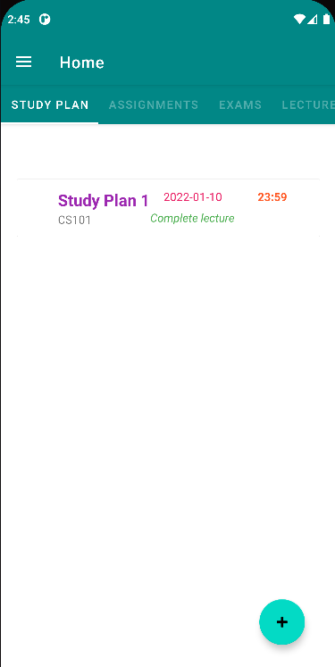
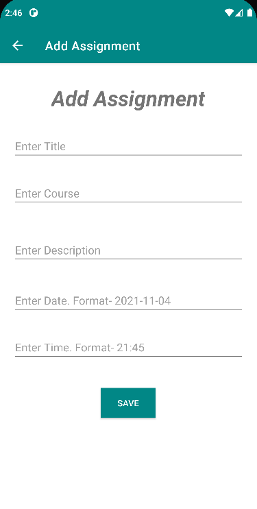
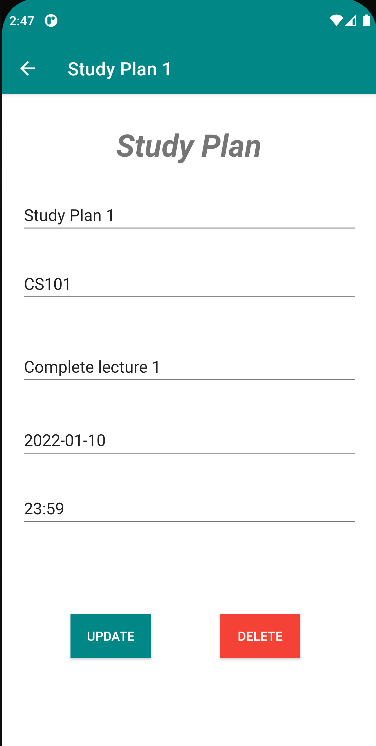
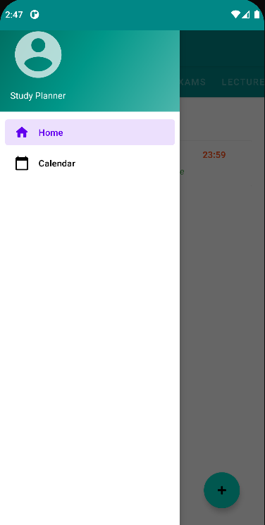
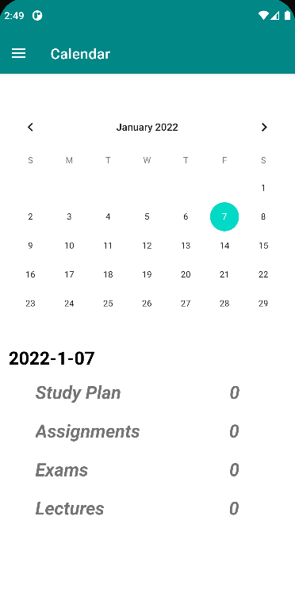

# Study-Planner-App

## Table of Contents
* [General Info](#general-information)
* [Technologies Used](#technologies-used)
* [Features](#features)
* [Screenshots](#screenshots)
* [Room for Improvement](#room-for-improvement)
* [Contact](#contact)

## General Information
- This project is a good start towards the usage of Android Studio for development of Android apps
- Students can use this app to organise and plan their work

## Technologies Used
- Android Studio and JDK 17.0.1
- SQLite Database

## Features
### Home
- The homescreen of the app has 4 tabs "Study Plans", "Assignments", "Exams", and "Lectures"
- Student can access the tabs and can use features provided under each tab
#### Study Plans Tab
- The study plan tab displays the study plans user has added
- It uses a recycler view to display each study plan. Each row of the recycler view displays title of the study plan; date and time set by the user for that particular study plan; course title and description
- The user can click on any study plan under this tab to either modify the details or delete it completely
- A floating action button with "+" sign is provided in the bottom right corner of the screen for the user to add new study plans. Clicking that button takes user to a screen where he is prompted to enter details of the study plan, namely, "title", "course title", "description", "date", and "time"
#### Assignments Tab
- The assignments tab displays the assignments user has added
- It uses a recycler view to display each assignment. Each row of the recycler view displays title of the exam; date and time (deadline) set by the user for that particular assignment; course title and description
- The user can click on any assignment under this tab to either modify the details or delete it completely
- A floating action button with "+" sign is provided in the bottom right corner of the screen for the user to add new assignments. Clicking that button takes user to a screen where he is prompted to enter details of the assignment, namely, "title", "course title", "description", "date", and "time"
#### Exams Tab
- The exams tab displays the exams user has added
- It uses a recycler view to display each exam. Each row of the recycler view displays title of the exam; date and time given by the user for that particular exam; course title and description
- The user can click on any exam under this tab to either modify the details or delete it completely
- A floating action button with "+" sign is provided in the bottom right corner of the screen for the user to add new exam. Clicking that button takes user to a screen where he is prompted to enter details of the exam, namely, "title", "course title", "description", "date", and "time"
#### Lectures Tab
- The study plan tab displays the lectures user has added
- It uses a recycler view to display each lecture. Each row of the recycler view displays title of the lecture; date and time set by the user for that particular lecture; course title and description
- The user can click on any lecture under this tab to either modify the details or delete it completely
- A floating action button with "+" sign is provided in the bottom right corner of the screen for the user to add new lectures. Clicking that button takes user to a screen where he is prompted to enter details of the lecture, namely, "title", "course title", "description", "date", and "time"

### Calendar
- Calendar screen displays a calendar and once a date is selected on the calendar, the user can see below the calendar, the number of study plans, assignments, exams, and lectures scheduled for that date
- We used the calendar view provided by Android Studio for displaying the calendar

### Side Navigation Drawer
- Student can use the side navigation drawer to switch between the aforementioned Home and Calendar screens

## Screenshots
### Home Screen:

### Add Event:

### Edit Event:

### Side Navigation Drawer:

### Calendar:

## Room for Improvement:
### Marking:
- A good feature to add will be the dates being marked, the ones on which there are events planned
### Reminders:
- Reminding the students about upcoming deadlines will be an useful feature to add

## Contact:
### Anubhab Ray
- 200050010@iitb.ac.in
### Mani Praneeth Chilukuri
- 200050028@iitb.ac.in
